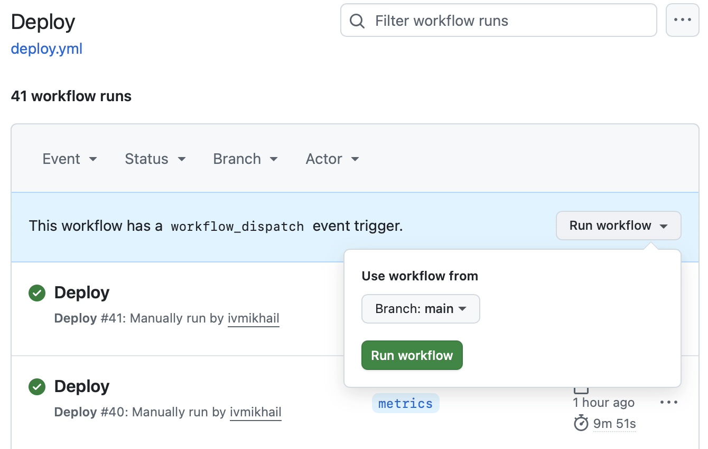

# round-robin

Take-Home Assignment: Round Robin API that receives HTTP POST requests and routes them to one of a list of Application APIs

* Original assignment [BE Engineering (2025) Updated.pdf](static/BE%20Engineering%20%282025%29%20Updated.pdf)
* Slides [Round Robin API.pdf](static/Round%20Robin%20API.pdf)

## Deployment

1. Go to [Github Actions](https://github.com/ivmikhail/round-robin/actions/workflows/deploy.yml)
2. Select Deploy workflow and desired branch, click Run

